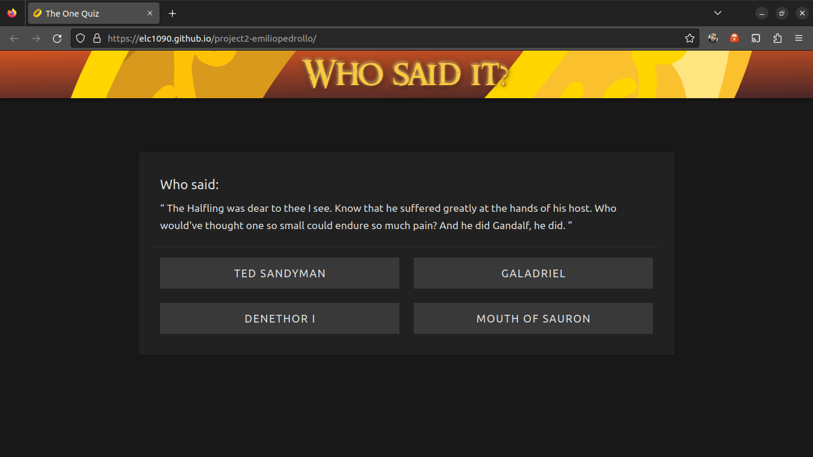

# Portfolio Gatsby

.
Acesso: https://elc1090.github.io/project2-emiliopedrollo/

#### Desenvolvedor(a)
Emilio B. Pedrollo

#### Tecnologias

- Vue
- Vite
- node

#### Ambiente de desenvolvimento

- Node/NPM
- PHPStorm

#### Bastidores

... todo

---
Projeto entregue para a disciplina de [Desenvolvimento de Software para a Web](http://github.com/andreainfufsm/elc1090-2023a) em 2023a
